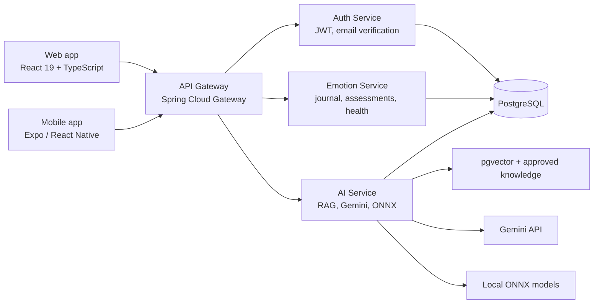

# MindCare — Nền tảng tự chăm sóc sức khỏe tinh thần

MindCare là một nền tảng full-stack hỗ trợ người dùng theo dõi cảm xúc, thực hiện các bài đánh giá sàng lọc, xây dựng thói quen tự chăm sóc và nhận gợi ý từ trợ lý AI. Dự án được thiết kế theo hướng **privacy-first**, có ranh giới an toàn rõ ràng: hỗ trợ nhận thức và định hướng sớm, **không chẩn đoán, điều trị, thay thế chuyên gia hay dịch vụ khẩn cấp**.

> Đây là portfolio project thể hiện năng lực xây dựng sản phẩm end-to-end: React/TypeScript, Spring Boot microservices, API gateway, bảo mật JWT, dữ liệu quan hệ có migration, AI/RAG và ML inference tại runtime.

## Giá trị sản phẩm

- **Theo dõi wellbeing hằng ngày:** nhật ký cảm xúc, xu hướng cảm xúc, chỉ số sức khỏe và lịch sử đánh giá.
- **Tự chăm sóc có cấu trúc:** thư viện nội dung đã được duyệt, đánh dấu yêu thích, nhắc nhở và kế hoạch tự chăm sóc.
- **AI có căn cứ:** chatbot tìm kiếm ngữ nghĩa trên nguồn kiến thức được quản trị, trả lời kèm trích dẫn thay vì dựa hoàn toàn vào mô hình ngôn ngữ.
- **Dự báo wellness, không phải y tế:** stress score và dự báo sleep/steps/resting heart rate chạy từ mô hình ONNX; hiệu năng và giới hạn được ghi nhận minh bạch trong tài liệu mô hình.
- **An toàn trong tình huống nhạy cảm:** phát hiện tín hiệu khủng hoảng, hướng dẫn tìm hỗ trợ phù hợp và không hứa hẹn can thiệp khẩn cấp.

## Kiến trúc



| Thành phần | Trách nhiệm chính | Công nghệ |
| --- | --- | --- |
| `mindcare-frontend/web-app` | Ứng dụng người dùng và quản trị viên | React 19, TypeScript, Vite, Tailwind CSS, React Query |
| `mobile-app` | Trải nghiệm di động và tích hợp Health Connect/HealthKit | Expo, React Native, TypeScript |
| `api-gateway` | Điểm vào duy nhất, CORS, định tuyến API/WebSocket | Spring Cloud Gateway |
| `auth-service` | Đăng ký, xác minh email, JWT, thông báo, bookmark, reminder | Spring Boot, Spring Security, PostgreSQL |
| `emotion-service` | Nhật ký cảm xúc, assessment, risk alert, health metric, self-care plan | Spring Boot, JPA, Flyway, MapStruct |
| `ai-service` | RAG, quản trị tài liệu, hội thoại, safety guardrails, inference | Spring Boot, pgvector, Gemini, ONNX Runtime |
| `ml-training` | Huấn luyện, đánh giá và xuất model ONNX có thể tái lập | Python, scikit-learn, ONNX |
| `infrastructure` | PostgreSQL, pgAdmin, Mailpit và dữ liệu demo | Docker Compose |

## Điểm nhấn kỹ thuật

- **Bảo mật theo lớp:** gateway xác thực JWT và chỉ chuyển tiếp identity headers đã xác minh; AI service không được thiết kế để public trực tiếp.
- **Data lifecycle có trách nhiệm:** người dùng có thể xuất JSON dữ liệu của mình hoặc xóa vĩnh viễn; thứ tự xóa giữa services được thiết kế idempotent để có thể retry khi lỗi mạng.
- **RAG được kiểm soát:** tài liệu được chunk theo câu, tìm bằng hybrid vector/full-text search, kết hợp bằng Reciprocal Rank Fusion và áp dụng chính sách nguồn tin cậy.
- **ML có đánh giá tách biệt:** pipeline stress dùng leave-one-participant-out; mô hình LifeSnaps dùng participant-level train/validation/test split và kiểm tra prediction parity giữa Python/ONNX.
- **Khả năng vận hành cục bộ:** một lệnh PowerShell khởi động toàn bộ stack, chờ health qua port và ghi log từng service vào `.run/`.
- **Chất lượng phần mềm:** frontend có lint/typecheck/build; backend có unit test và integration test với PostgreSQL Testcontainers.

## Khởi chạy cục bộ

### Yêu cầu

- Docker Desktop
- Java 17+
- Node.js 20+ và npm
- Python 3.11+ *(chỉ cần khi huấn luyện lại model)*
- Gemini API key *(chỉ cần khi bật AI service)*

### Khởi động toàn bộ hệ thống

```powershell
# Từ thư mục gốc repository
Copy-Item .env.example .env
# Mở .env, thay GEMINI_API_KEY bằng key của bạn

.\run-all.ps1 -SeedDemo
```

Sau khi script hoàn tất:

| Dịch vụ | URL |
| --- | --- |
| Web app | http://localhost:5173 |
| API Gateway | http://localhost:8079 |
| Mailpit (email local) | http://localhost:8025 |
| pgAdmin | http://localhost:5050 |

Tài khoản demo có mật khẩu `MindCare@123`:

| Vai trò | Email |
| --- | --- |
| Admin | `admin@mindcare.local` |
| User | `user1@mindcare.local` đến `user6@mindcare.local` |

Một vài tùy chọn hữu ích:

```powershell
.\run-all.ps1 -SkipAi              # Chạy khi chưa có Gemini API key
.\run-all.ps1 -RestartExisting     # Giải phóng các port của stack trước khi chạy
.\stop-all.ps1                     # Dừng các tiến trình do script khởi tạo
```

> Không commit `.env`, dữ liệu huấn luyện gốc hoặc artifact model cục bộ. Hãy dùng `.env.example` làm mẫu cấu hình.

## Kiểm tra chất lượng

```powershell
# Frontend
cd mindcare-frontend\web-app
npm install
npm run lint
npm run typecheck
npm run build

# Mỗi backend service (ví dụ AI service)
cd ..\..\ai-service
.\mvnw.cmd test
```

Các integration test backend dùng Testcontainers, vì vậy Docker cần đang chạy.

## ML và AI: cách tiếp cận có trách nhiệm

Các model chỉ được dùng để cung cấp **wellness insights**. Chúng không phải thiết bị y tế, không chẩn đoán bệnh và không được dùng để ra quyết định điều trị.

- Stress model được xây dựng từ PMData; v3 chọn Random Forest sau đánh giá leave-one-participant-out trên 1.680 mẫu/16 người tham gia.
- Ba mô hình LifeSnaps dự báo chỉ số ngày kế tiếp (ngủ, bước chân, nhịp tim nghỉ), đánh giá trên người tham gia chưa từng thấy.
- Tài liệu RAG, safety workflow, conversation retention và metric mô hình nằm trong [`ai-service/docs`](./ai-service/docs/).
- Pipeline tái huấn luyện, nguồn dữ liệu và báo cáo metric nằm trong [`ml-training`](./ml-training/README.md).

## Tài liệu thiết kế

- [Phạm vi sản phẩm và các điều không làm](./BUSINESS_SCOPE.md)
- [Quyền riêng tư: export và xóa vĩnh viễn dữ liệu](./PRIVACY_DATA_RIGHTS.md)
- [Kiến trúc frontend](./mindcare-frontend/web-app/ARCHITECTURE.md)
- [RAG architecture](./ai-service/docs/RAG-ARCHITECTURE.md)
- [Crisis safety workflow](./ai-service/docs/CRISIS-SAFETY-WORKFLOW.md)
- [Hướng dẫn infrastructure và demo data](./infrastructure/README.md)

## Lộ trình có ý nghĩa

- Bổ sung CI để chạy lint, typecheck, unit và integration tests trên pull request.
- Thêm observability production: structured logs, tracing và metrics.
- Đánh giá mô hình trên dữ liệu MindCare có consent, kèm kiểm định fairness và human review trước khi mở rộng sử dụng.
- Hoàn thiện tích hợp Health Connect/HealthKit sau khi xác thực luồng consent và quyền truy cập dữ liệu.

## Lưu ý an toàn

MindCare không phải dịch vụ cấp cứu. Nếu bạn hoặc người khác đang có nguy cơ tự làm hại bản thân hoặc ở trong tình huống khẩn cấp, hãy liên hệ số khẩn cấp tại địa phương, cơ sở y tế gần nhất hoặc một người đáng tin cậy ngay lập tức.
